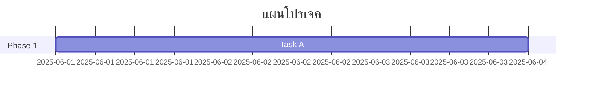

# คู่มือการเขียนไฟล์ SKILL.md (แบบละเอียด)

ไฟล์ `SKILL.md` เป็นเอกสารที่ใช้สำหรับนิยาม **ความสามารถเฉพาะทาง (Skill)** ให้กับ AI Assistant (เช่น Claude, GPT พร้อม custom instructions) หรือใช้ในระบบที่รองรับการโหลดทักษะอัตโนมัติ เช่น Claude Code, AutoGPT, หรือแพลตฟอร์มที่ใช้ Markdown เป็นฐานในการกำหนดพฤติกรรมของ Agent

เนื้อหาด้านล่างนี้จะอธิบายโครงสร้าง องค์ประกอบสำคัญ พร้อมตัวอย่างที่สมบูรณ์ เพื่อให้คุณสามารถเขียน SKILL.md ได้อย่างมืออาชีพ

---

## 🧱 โครงสร้างหลักของ SKILL.md

ไฟล์ที่ดีควรประกอบด้วย 6 ส่วนหลัก ดังนี้

1. **Metadata** (ข้อมูลนำเข้า)
2. **ภาพรวมและวัตถุประสงค์** (Overview & Purpose)
3. **สถานการณ์ที่ควรใช้** (When to Use)
4. **วิธีดำเนินการทีละขั้น** (Step-by-Step Instructions)
5. **ตัวอย่างผลลัพธ์ที่คาดหวัง** (Expected Output / Examples)
6. **ข้อกำหนดและข้อควรระวัง** (Prerequisites & Caveats)

---

## 📝 รายละเอียดแต่ละส่วน

### 1. Metadata
ข้อมูลพื้นฐานเพื่อให้ระบบรู้จัก skill นี้

```yaml
---
name: ชื่อทักษะ (ภาษาอังกฤษหรือไทย)
version: 1.0.0
author: ชื่อผู้เขียน
trigger_keywords: ["คำ", "ที่", "กระตุ้น"]
required_capabilities: [web_search, code_execution] # ถ้ามี
---
```

### 2. ภาพรวมและวัตถุประสงค์
บอกว่า skill นี้ใช้ทำอะไร และช่วยแก้ปัญหาใด

### 3. สถานการณ์ที่ควรใช้
列举เงื่อนไขหรือตัวอย่าง prompt ที่ควรเปิดใช้ skill นี้

### 4. วิธีดำเนินการทีละขั้น
เขียนลำดับการทำงานที่ AI ต้องทำตาม โดยใช้ภาษาสั่งการ (imperative) ชัดเจน

### 5. ตัวอย่างผลลัพธ์
แสดง input -> output ที่สมมติขึ้น เพื่อให้ AI เห็นภาพต้นแบบ

### 6. ข้อกำหนดและข้อควรระวัง
เช่น ต้องมี API key, ห้ามทำอะไร, หรือข้อจำกัดด้านความปลอดภัย

---

## 📄 ตัวอย่าง SKILL.md แบบสมบูรณ์

ลองดูตัวอย่างทักษะ **“ตรวจสอบและสรุปบทความทางวิชาการ”** (Academic Paper Summarizer)

```markdown
---
name: Academic Paper Summarizer
version: 1.0.0
author: Dev Team
trigger_keywords: ["สรุป paper", "บทความวิชาการ", "academic summary"]
required_capabilities: [document_reader, long_context]
---

# 📚 Academic Paper Summarizer Skill

## ภาพรวมและวัตถุประสงค์
ทักษะนี้มีไว้สำหรับอ่านบทความวิชาการ (PDF หรือข้อความที่วางมา) และสร้างบทสรุปที่มีโครงสร้าง ประกอบด้วย:
- ปัญหาที่งานวิจัยต้องการแก้
- วิธีการที่ใช้
- ผลลัพธ์สำคัญ
- ข้อจำกัด
- ความเห็นของผู้เขียน (เชิงวิจารณ์เบื้องต้น)

## สถานการณ์ที่ควรใช้
ใช้ skill นี้เมื่อ:
- ผู้ใช้บอกว่า “ช่วยสรุป paper นี้ให้หน่อย”
- ผู้ใช้อัปโหลดไฟล์ PDF งานวิจัยแล้วขอให้ย่อความ
- ผู้ใช้ถามว่า “งานวิจัยนี้พูดเกี่ยวกับอะไร” และบทความมีความยาว > 2,000 คำ

## วิธีดำเนินการทีละขั้น

1. **อ่านเนื้อหาทั้งหมด**  
   - หากเป็นไฟล์ PDF ให้ดึงข้อความออกมาอย่างครบถ้วน  
   - ถ้าผู้ใช้วางข้อความมาโดยตรง ให้นำไปประมวลผลทันที

2. **ระบุส่วนประกอบหลักของบทความ**  
   ให้หาให้เจอ: Abstract, Introduction, Methodology, Results, Discussion, Conclusion  
   ถ้าขาดส่วนใดให้ใช้เนื้อหาที่ใกล้เคียงแทน

3. **เขียนสรุปตามหัวข้อบังคับต่อไปนี้**  
   - **คำถามวิจัย / ปัญหา**: 1-2 ประโยค  
   - **วิธีการ**: บอกเทคนิค, ตัวแปร, กลุ่มตัวอย่าง, เครื่องมือ  
   - **ผลลัพธ์**: ตัวเลขหรือข้อค้นพบที่สำคัญที่สุด 3 ข้อ  
   - **ข้อจำกัด**: อย่างน้อย 1 ข้อ ที่ผู้เขียนยอมรับ หรือที่คุณสังเกตเห็น  
   - **ความเห็นเพิ่มเติม**: (ระวังอย่าใช้อารมณ์) ชี้จุดแข็งและจุดอ่อนของงาน

4. **จัดรูปแบบผลลัพธ์**  
   ใช้ Markdown หัวข้อ และใช้ **ตัวหนา** สำหรับค่าสำคัญ

5. **ถามยืนยันผู้ใช้**  
   หลังจากแสดงสรุป ให้ถามว่า “ต้องการให้เจาะลึกส่วนใดเพิ่มไหม”

## ตัวอย่างผลลัพธ์

**Input:**
> ผู้ใช้แปะ abstract และ method ของ paper เรื่อง “ผลของการนอน 4 ชั่วโมงต่อประสิทธิภาพการเขียนโค้ด”

**Output ที่คาดหวัง:**

### สรุปบทความ: ผลของการนอน 4 ชม. ต่อประสิทธิภาพการเขียนโค้ด

**คำถามวิจัย**  
การนอนเพียง 4 ชั่วโมงติดต่อกัน 3 คืน ส่งผลต่อจำนวนบรรทัดที่เขียนได้ และจำนวนบั๊กในโค้ดหรือไม่

**วิธีการ**  
ทดลองกับนักศึกษาวิศวฯ 30 คน แบ่งกลุ่มทดลอง (นอน 4 ชม.) และกลุ่มควบคุม (นอน 8 ชม.) ใช้เครื่องมือวัดประสิทธิภาพด้วย IDE plugin เป็นเวลา 3 วัน

**ผลลัพธ์**  
- กลุ่มทดลองเขียนโค้ดได้น้อยลง **42%**  
- จำนวนบั๊กเพิ่มขึ้น **2.3 เท่า**  
- ไม่พบความแตกต่างในวันที่ 1 แต่ชัดเจนในวันที่ 2-3

**ข้อจำกัด**  
กลุ่มตัวอย่างน้อย และเป็นการทดลองระยะสั้น ขาดการวัดคุณภาพของอัลกอริทึม

**ความเห็นเพิ่มเติม**  
จุดแข็ง: มีการวัดเชิงปริมาณชัดเจน  
จุดอ่อน: ไม่มีการสุ่มอย่างสมบูรณ์ และไม่ได้ควบคุมระดับทักษะ编程เดิม

> ต้องการให้เจาะลึกส่วนวิธีการหรือผลลัพธ์เพิ่มไหม?

## ข้อกำหนดและข้อควรระวัง

- **ห้าม** สรุปโดยการตัดแค่ Abstract อย่างเดียว เพราะอาจขาดรายละเอียด
- **ห้าม** เปลี่ยนตัวเลขหรือข้อเท็จจริงจากต้นฉบับ
- **หากบทความมีตารางซับซ้อน** ให้บอกผู้ใช้ว่า “สรุปเฉพาะตัวเลขหลักได้ แต่แนะนำให้ดูตารางต้นฉบับ”
- ทักษะนี้ใช้ได้กับบทความภาษาอังกฤษหรือไทยเท่านั้น (ไม่รองรับภาษาที่สามในตอนนี้)
- หากเนื้อหาเกิน 50,000 ตัวอักษร ให้แจ้งผู้ใช้ว่า “กรุณาตัดบางส่วนหรือใช้วิธีอ่านทีละตอน”
```

---

## 🧰 เทคนิคการเขียน SKILL.md ให้มีประสิทธิภาพสูง

### ✅ ใช้คำสั่งที่ชัดเจน ไม่กำกวม
- แทนที่จะเขียน “อ่านเนื้อหาให้เข้าใจ”  
  เขียนว่า “แยกเนื้อหาออกเป็นหัวข้อ: บทนำ, วิธีดำเนินการ, ผลลัพธ์, สรุป”

### ✅ กำหนด Output Format เสมอ
ให้ AI รู้ว่าโครงสร้างผลลัพธ์ที่คาดหวังเป็นแบบไหน (bullet, table, code block, etc.)

### ✅ จำกัดขอบเขตการทำงาน
เขียนข้อห้ามหรือข้อควรระวังไว้ ป้องกัน AI ทำสิ่งที่อาจผิดพลาด

### ✅ ใส่ตัวอย่าง Input-Output จริง
ยิ่งตัวอย่างใกล้เคียงกับงานจริงมากเท่าไร AI จะทำตามได้ถูกต้องมากขึ้นเท่านั้น

### ✅ ระบุ Trigger Keywords
ช่วยให้ระบบรู้ว่าควรโหลด skill นี้เมื่อใด (สำหรับ platform ที่รองรับ)

### ✅ รักษา Version และอัปเดต
เมื่อปรับปรุงขั้นตอน ให้เปลี่ยน version และใส่ changelog สั้น ๆ ไว้ส่วนท้าย

---

## วิธีเก็บข้อมูลลงไฟล์ `.md` (Markdown) ให้เยอะ ๆ และเป็นระบบ

การเก็บข้อมูลจำนวนมากในไฟล์ Markdown ไม่ใช่แค่ “เขียนใส่ไฟล์เดียวไปเรื่อย ๆ” แต่ต้องออกแบบโครงสร้างให้ค้นหา จัดหมวดหมู่ และเชื่อมโยงข้อมูลได้ง่าย โดยเฉพาะเมื่อมีไฟล์เป็นร้อยหรือพันไฟล์ ด้านล่างคือ **รูปแบบและเทคนิคยอดนิยม** ที่ใช้กันในหมู่คนทำความรู้ส่วนตัว, นักพัฒนา, และทีมงาน

---

## 1. 📁 การจัดโครงสร้างโฟลเดอร์ (Knowledge Base Structure)

### แบบแยกตามประเภทข้อมูล (PARA method)
เหมาะสำหรับงานและโปรเจกต์  
```
📂 Projects/          # โปรเจกต์กำลังทำ
📂 Areas/             # ด้านความรับผิดชอบ長期 (สุขภาพ, การเงิน)
📂 Resources/         # ข้อมูลอ้างอิง, สรุป, คู่มือ
📂 Archives/          # งานที่เสร็จแล้ว, ไม่ได้ใช้แล้ว
```

### แบบแยกตามหมวดวิชา / หัวข้อ
```
📂 Tech/
   ├── Python/
   ├── Docker/
📂 Business/
   ├── Marketing/
   ├── Finance/
📂 Personal/
   ├── Journal/
   ├── Learn/
```

### แบบ MOC (Map of Content)
ใช้ไฟล์ `index.md` หรือ `<topic>.md` เป็นสารบัญเชื่อมไปยังไฟล์อื่น ๆ  
**ตัวอย่าง** `python-index.md`:
```markdown
# เนื้อหา Python ทั้งหมด
- [[basics]] - ตัวแปร, loop, function
- [[oop]] - คลาสและ inheritance
- [[libraries]] - numpy, pandas, requests
```

---

## 2. 🧩 รูปแบบของไฟล์ Markdown แต่ละไฟล์ (สำหรับข้อมูลหนาแน่น)

### A. ไฟล์แบบ “ความรู้อะตอม” (Atomic Note)
- ไฟล์หนึ่งเรื่อง หนึ่งแนวคิด
- ชื่อไฟล์: `สั้น-เกียวกับ-อะไร.md`  
  ตัวอย่าง: `git-rebase-vs-merge.md`
- ขนาดไม่เกิน 500 บรรทัด (อ่านจบใน 3-5 นาที)
- **ข้อดี**: นำไปเชื่อมโยงกับที่อื่นง่าย, จัดเรียงใหม่ได้ยืดหยุ่น

### B. ไฟล์แบบ “สรุปยอดนิยม” (Comprehensive Guide)
- สำหรับหัวข้อใหญ่ที่ต้องมีข้อมูลครบจบในไฟล์เดียว
- มีสารบัญ (TOC) และ anchor link  
  ตัวอย่าง: `docker-complete-guide.md`
```markdown
# คู่มือ Docker ฉบับสมบูรณ์
## สารบัญ
1. [พื้นฐาน](#1-พื้นฐาน)
2. [การติดตั้ง](#2-การติดตั้ง)
3. ...
## 1. พื้นฐาน
...
```

### C. ไฟล์ข้อมูลแบบ “ตาราง / ฐานข้อมูลอย่างง่าย”
ใช้ Markdown Table + Front Matter + ตัวช่วย (เช่น Obsidian DB Folder, Dataview)
```markdown
---
tags: [book, to-read]
author: "ชื่อผู้แต่ง"
---
# หนังสือ 1984
| หัวข้อ | รายละเอียด |
|--------|-------------|
| ผู้แต่ง | George Orwell |
| ปี | 1949 |
| สรุป | ... |
```

### D. ไฟล์ “คำถาม-คำตอบ” (FAQ / Q&A)
เหมาะสำหรับเก็บความรู้ซ้ำ ๆ หรือ Troubleshooting  
```markdown
# Docker FAQ
## Q: จะล้าง container ทั้งหมดยังไง?
**A:** ใช้คำสั่ง `docker container prune` หรือ `docker rm $(docker ps -aq)`
## Q: container ออก memory ทำไง?
**A:** ...
```

---

## 3. 🔗 เทคนิคการเชื่อมโยงข้อมูล (สำหรับ Markdown ทั่วไป)

### การลิงก์ข้ามไฟล์
- **ในโฟลเดอร์เดียวกัน**: `[[ชื่อไฟล์]]` (Obsidian, Logseq) หรือ `[ชื่อ](ชื่อไฟล์.md)`
- **ข้ามโฟลเดอร์**: `[[โฟลเดอร์/ชื่อไฟล์]]`
- **anchor ในไฟล์เดียวกัน**: `[ไปที่ส่วนสรุป](#สรุป)`

### การใช้ Tags
- ใส่ `#python`, `#todo` ไว้ท้ายไฟล์หรือส่วนหัว  
- จากนั้นใช้เครื่องมือค้นหาหรือปลั๊กอินรวบรวม tag (เช่น Obsidian Tag Pane)

### การทำ MOC (Map of Content) แบบหลายระดับ
สร้างไฟล์ `_toc.md` ที่รวบรวมลิงก์ไปยัง MOC ย่อย  
```markdown
# สารบัญความรู้ทั้งหมด
- [[dev/index|การพัฒนา]]
- [[business/index|ธุรกิจ]]
- [[life/index|ชีวิตส่วนตัว]]
```

---

## 4. ⚙️ เครื่องมือเสริมสำหรับจัดการ Markdown จำนวนมาก

ถ้าคุณมีไฟล์ Markdown เกิน 100+ ไฟล์ ควรใช้:

| เครื่องมือ | เหมาะกับ |
|------------|-----------|
| **Obsidian** | เชื่อมโยงไฟล์, กราฟความรู้, ค้นหาด้วย tags/link, ปลั๊กอิน Dataview สำหรับ query ข้อมูล |
| **Logseq** | การจดแบบ outliner, ใช้ block reference แทนไฟล์ |
| **Foam** (VS Code) | นักพัฒนาที่อยากเก็บความรู้ใน VSCode |
| ** MkDocs / Docusaurus ** | สร้างเว็บเอกสารจาก Markdown มี search ในตัว |
| **grep / ripgrep** | ค้นหาเนื้อหาทั่วไฟล์เร็วมาก ใช้กับ terminal |
| **Git** | เก็บบันทึกการเปลี่ยนแปลง และทำงานเป็นทีม |

---

## 5. 📋 เทมเพลตสำเร็จรูปสำหรับเก็บข้อมูลประเภทต่าง ๆ

### เทมเพลตสรุปหนังสือ / บทความ
```markdown
# ชื่อหนังสือ/บทความ
**ผู้เขียน**:
**วันที่อ่าน**:
**เหตุผลที่อ่าน**:
**3 ประเด็นหลัก**:
1. 
2. 
3. 
**ประโยคเด็ด**:
**การนำไปใช้**:
```

### เทมเพลต meeting notes
```markdown
# Meeting: [ชื่อ] - วว/ดด/ปปปป
**ผู้เข้าร่วม**:
**วาระ**:
- 
**การตัดสินใจ**:
- 
**Action Items**:
- [ ] @คนรับผิดชอบ งานนี้ (due date)
```

### เทมเพลตฐานข้อมูล API / คำสั่ง
```markdown
# คำสั่ง Docker ที่ใช้บ่อย
| คำสั่ง | คำอธิบาย | ตัวอย่าง |
|--------|-----------|----------|
| `docker ps` | ดู container ที่กำลังทำงาน | `docker ps -a` |
| `docker exec` | รันคำสั่งใน container | `docker exec -it <id> bash` |
```

### เทมเพลตความรู้รายวัน (Daily Note)
```markdown
# Daily Note 2025-05-17
## 🔥 เรียนรู้วันนี้
- 
## 🧠 สรุปสั้น ๆ
- 
## 🔗 เชื่อมโยงกับความรู้เดิม
- [[ชื่อไฟล์]]
```

---

## 6. 🧹 หลักการทำความสะอาดและรักษาความยั่งยืน

เมื่อคุณมีไฟล์ Markdown หลายพันไฟล์:

1. **ตั้งชื่อไฟล์ให้เป็นมาตรฐาน**  
   - ใช้ `kebab-case` หรือ `snake_case` ตลอดทั้งระบบ  
   - ไม่ใช้ภาษาไทยผสมอังกฤษ (เพื่อการค้นหาด้วย regex)

2. **เก็บ metadata ใน Front Matter** (YAML)  
   ```yaml
   ---
   tags: [python, fastapi]
   created: 2025-05-17
   status: draft  # หรือ evergreen, archived
   ---
   ```

3. **ใช้ตัวตรวจสอบลิงก์เสีย**  
   - Obsidian มีปลั๊กอิน Clear Unused Images  
   - `find . -name "*.md" -exec grep -L "\[\[.*\]\]" {} \;` หาไฟล์ไม่มีลิงก์ออก

4. **ป้องกันไฟล์ใหญ่เกินไป**  
   - ถ้าไฟล์ใดเกิน 5,000 บรรทัด → แยกเป็นหลายไฟล์ แล้วทำ MOC ครอบ

5. **ใช้ Git จัดการเวอร์ชัน**  
   ```bash
   git init
   git add .
   git commit -m "จัดระเบียบความรู้ใหม่"
   ```

---

## 🧭 สรุป – เลือกแบบไหนให้เหมาะกับคุณ?

| ถ้าคุณ... | แนะนำรูปแบบ |
|------------|----------------|
| จดโน้ตส่วนตัว อยากเชื่อมโยงความคิด | **Atomic Note + Obsidian** + MOC |
| ทำคู่มือ เทคนิคสำหรับทีม | **Comprehensive Guide** ไฟล์เดียว + สารบัญ |
| เก็บข้อมูลหลากหลายประเภท (โปรเจกต์, การเงิน, สุขภาพ) | **PARA structure** + Daily Notes |
| ต้องการสืบค้นเร็ว ใช้คำสั่ง grep | **แยกโฟลเดอร์ลึก 2-3 ระดับ** + ตั้งชื่อไฟล์สม่ำเสมอ |
| ทำงานเป็นทีม อยากให้ search ได้ | **MkDocs** + `search` plugin + Git |

ถ้าคุณเริ่มต้นจากศูนย์ ลองทำตามนี้:
1. สร้างโฟลเดอร์ `Notes/`
2. สร้าง `index.md` เป็น MOC หลัก
3. เขียนบันทึกวันนี้ 1 ไฟล์แล้วลิงก์ไป `index.md`
4. เมื่อข้อมูลแน่นขึ้น ค่อยแตกไฟล์และเพิ่ม tags

และที่สำคัญ: **ไม่ต้องเก็บให้สวยงามมากตั้งแต่แรก** – ระบบที่ดีที่สุดคือระบบที่คุณใช้ต่อเนื่องได้จริงครับ


# ชุดสกิลและ Prompt สำหรับงานเฉพาะทาง (พร้อมใช้งานจริง)

ด้านล่างคือ **10 สกิลเฉพาะทาง** แต่ละตัวประกอบด้วย:
- โครงสร้าง SKILL.md แบบย่อ (ใช้ใน AI ที่รองรับ custom instructions หรือระบบ skill-based)
- ตัวอย่าง Prompt ที่ผู้ใช้สามารถพิมพ์เรียกใช้งานได้ทันที

เลือกใช้ตามความต้องการ หรือนำไปปรับแต่งเพิ่มได้เลยครับ

---

## 1. 🧠 สกิลตรวจสอบและปรับภาษา (Thai/English Proofreader)

### SKILL.md
```yaml
name: Proofreader Pro
version: 1.0
trigger: ["ตรวจภาษา", "พิสูจน์อักษร", "proofread", "ไวยากรณ์"]
```

```markdown
# Proofreader Pro Skill

## ขั้นตอน
1. อ่านข้อความต้นฉบับทั้งหมด
2. ตรวจสอบ:
   - การสะกดคำ (ไทย/อังกฤษ)
   - ไวยากรณ์และโครงสร้างประโยค
   - การใช้ระดับภาษา (ทางการ/ไม่ทางการ)
   - การเว้นวรรค, เครื่องหมายวรรคตอน
3. เสนอแก้ไขพร้อมอธิบายเหตุผลสั้น ๆ (ถ้าผู้ใช้ต้องการ)
4. ให้เวอร์ชันที่แก้ไขแล้ว

## รูปแบบ output
**ข้อความต้นฉบับ:** ...
**ข้อเสนอแก้ไข:** [ขีดเส้นใต้หรือ highlight]
**เวอร์ชันที่แก้ไข:** ...
**หมายเหตุ:** (อธิบายจุดสำคัญ)
```

### Prompt ตัวอย่าง
```
ช่วยตรวจภาษาให้หน่อย ข้อความนี้:
“เมื่อวานฉันไปซื้อกับข้าวที่ตลาด แต่ลืมเอาเงินไปด้วย พอดีมีเพื่อนยืมให้ก่อน แล้ววันนี้ก็ยังไม่ได้คืนเลย”

(ต้องการให้เก็บบุคลิกแบบเป็นกันเอง)
```

---

## 2. 🎥 สกิลสรุป YouTube Video (ไม่ต้องดูเอง)

### SKILL.md
```yaml
name: YouTube Summarizer
version: 1.0
trigger: ["สรุปคลิป", "ยูทูป", "youtube.com/watch"]
```

```markdown
# YouTube Summarizer Skill

## ข้อกำหนดเบื้องต้น
- ผู้ใช้ต้องให้ URL หรือ transcript (ถ้ามี)
- ถ้าให้ URL → ใช้ความสามารถดึง transcript อัตโนมัติ (รองรับเฉพาะคลิปที่มี CC)

## ขั้นตอน
1. รับ URL จากผู้ใช้
2. ดึง transcript (ภาษาอังกฤษหรือไทย)
3. ตัดส่วนที่ไม่เกี่ยวข้อง (คำทักทาย, โฆษณา)
4. สรุปเป็น 5 หัวข้อ:
   - ประเด็นหลัก
   - ตัวอย่างสำคัญ (ถ้ามี)
   - ข้อสรุป
   - คำแนะนำ/การนำไปใช้
   - คำคมเด็ด (ถ้ามี)
5. ถ้า transcript ไม่มี → แนะนำให้เปิด CC หรือวางลิงก์อื่น

## Output
ใช้ bullet points และหัวข้อรอง (###)
```

### Prompt ตัวอย่าง
```
สรุปคลิปนี้ให้หน่อย https://youtu.be/abc123XYZ
(ถ้าไม่มีซับไทย แปลสรุปเป็นไทยก็ได้)
```

---

## 3. 📊 สกิลวิเคราะห์ข้อมูลจาก Excel/CSV (Data Analyst)

### SKILL.md
```yaml
name: Data Analyst Lite
version: 1.0
trigger: ["วิเคราะห์ excel", "csv", "ข้อมูลในตาราง"]
```

```markdown
# Data Analyst Lite Skill

## ความสามารถ
- อ่านไฟล์ .csv, .xlsx ที่ผู้ใช้อัปโหลด
- คำนวณสถิติพื้นฐาน: ค่าเฉลี่ย, มัธยฐาน, ส่วนเบี่ยงเบนมาตรฐาน
- หาความสัมพันธ์เชิงเส้น (correlation)
- สร้างกราฟแบบง่าย (ถ้าสนับสนุน)
- จับ outliers

## ขั้นตอน
1. ขอให้ผู้ใช้อัปโหลดไฟล์หรือวางข้อมูลตัวอย่าง
2. อธิบายโครงสร้างข้อมูล (ชื่อคอลัมน์, ชนิดข้อมูล, จำนวนแถว)
3. ถามคำถามปลายเปิด: “คุณอยากรู้เรื่องอะไรจากข้อมูลนี้”
4. ทำการวิเคราะห์ตามที่ขอ พร้อมสรุปตัวเลขสำคัญ
5. แสดงผลเป็นตาราง + ข้อความสรุป

## ข้อห้าม
- ห้ามเปิดเผยข้อมูลส่วนตัว (ถ้ามีให้แนะนำให้ anonymize ก่อน)
```

### Prompt ตัวอย่าง
```
ผมมีไฟล์ CSV ขายสินค้า 3 เดือน  ช่วยหาว่า:
- เดือนไหนยอดขายสูงสุด
- สินค้าตัวไหนขายดีที่สุด
- มีแนวโน้มขึ้นหรือลง

ไฟล์ชื่อ sales.csv (จะอัปโหลดให้)
```

---

## 4. 🐍 สกิลเขียน Python สำหรับ Data Science (Code Generator)

### SKILL.md
```yaml
name: Python Data Scribe
version: 1.0
trigger: ["เขียน python", "โค้ด pandas", "visualization", "ช่วยวิเคราะห์"]
```

```markdown
# Python Data Scribe Skill

## ภารกิจ
- เขียนโค้ด Python ที่ clean, มี docstring, และพร้อมรัน
- ใช้ pandas, matplotlib/seaborn, numpy ตามความเหมาะสม
- อธิบายแต่ละส่วนของโค้ด

## ขั้นตอน
1. ถามรายละเอียด: ข้อมูลอะไร, ต้องการ output อะไร (ตัวเลข, กราฟ, ตาราง?)
2. เขียนโค้ดพร้อมตัวอย่างข้อมูลจำลอง ถ้าผู้ใช้ยังไม่มีข้อมูลจริง
3. แสดงตัวอย่างผลลัพธ์ (สมมติ)
4. แนะนำวิธีปรับใช้กับข้อมูลจริง

## ตัวอย่าง prompt ที่ดี
“เขียนฟังก์ชันที่อ่าน CSV แล้วสร้าง scatter plot ระหว่าง column A กับ B มี trend line”
```

### Prompt ตัวอย่าง
```
ช่วยเขียน Python ให้หน่อย:
- อ่านไฟล์ students.csv (มีคอลัมน์: name, math_score, reading_score)
- คำนวณคะแนนเฉลี่ยของแต่ละวิชา
- วาด histogram ของคะแนนคณิตศาสตร์
- บอกจำนวนคนที่ได้คะแนน >80
```

---

## 5. 📧 สกิลตอบอีเมลลูกค้า (แบบมืออาชีพ)

### SKILL.md
```yaml
name: Email Responder Pro
version: 1.0
trigger: ["เขียนอีเมลตอบ", "ตอบกลับลูกค้า", "email template"]
```

```markdown
# Email Responder Pro Skill

## โทนที่รองรับ
- เป็นทางการ (ทางการมาก)
- กึ่งทางการ (เพื่อนร่วมงาน)
- เป็นมิตร (support ลูกค้า)
- ขอโทษ / แก้ปัญหา

## ขั้นตอน
1. รับเนื้อหาอีเมลที่ต้องการตอบ (หรือประเด็น)
2. สอบถามโทนและข้อมูลเพิ่ม: ชื่อผู้รับ, รายละเอียดปัญหา
3. เขียนอีเมลแบบมีหัวเรื่อง + คำทักทาย + เนื้อหา + สรุป + ลายเซ็น
4. ให้ผู้ใช้ตรวจสอบและปรับ

## Template เสมอ
**หัวเรื่อง:** [สรุปสั้น ๆ]
**ถึง:** [ชื่อ]
**เนื้อหา:** ...
**ลงชื่อ:** ...
```

### Prompt ตัวอย่าง
```
ลูกค้าส่งอีเมลมาว่า "สินค้าที่สั่งไปไม่ได้รับของเลย ส่งมา 2 อาทิตย์แล้ว" 
ช่วยตอบแบบขอโทษ พร้อมบอกว่าจะตรวจสอบให้ภายใน 24 ชม. ใช้โทนสุภาพและเห็นใจ
```

---

## 6. 🚀 สกิลเขียนเนื้อหา SEO สำหรับบทความ

### SKILL.md
```yaml
name: SEO Content Writer
version: 1.0
trigger: ["เขียน seo", "บทความ seo", "content marketing"]
```

```markdown
# SEO Content Writer Skill

## องค์ประกอบบังคับ
- คำหลักหลัก (primary keyword) ใน: title, h1, 100 คำแรก, alt text
- คำหลักรอง 2-3 คำ
- ความยาว > 1,200 คำ
- โครงสร้าง: H1, H2, H3, bullet points, ตาราง (ถ้าเหมาะสม)
- มีส่วน FAQ ที่มี schema จัดรูปแบบ

## ขั้นตอน
1. ขอหัวข้อ + คำหลักหลัก
2. ค้นหาข้อมูลพื้นฐาน (ถ้ามี web search)
3. เขียน outline ก่อนให้อนุมัติ
4. เขียนเนื้อหาครบถ้วน ใส่ internal linking suggestion
5. แนะนำ meta description และ URL slug

## ตัวอย่าง output
แสดงเป็น Markdown พร้อมหัวข้อ
```

### Prompt ตัวอย่าง
```
เขียนบทความ SEO เรื่อง “วิธีเลือกที่นอนสำหรับคนปวดหลัง” 
คำหลักหลัก: ที่นอนคนปวดหลัง
คำรอง: ที่นอนฟองน้ำ, ที่นอนสปริง, ท่านอนที่ถูกต้อง
กลุ่มเป้าหมาย: อายุ 30-50
```

---

## 7. 💰 สกิลวางแผนการเงินส่วนบุคคล (Personal Finance)

### SKILL.md
```yaml
name: Money Guide
version: 1.0
trigger: ["วางแผนการเงิน", "ออมเงิน", "ลงทุน", "หนี้สิน"]
```

```markdown
# Money Guide Skill

## ข้อมูลที่ต้องขอจากผู้ใช้
- รายได้ต่อเดือน
- ค่าใช้จ่ายก้อนหลัก (ค่าบ้าน, ค่าเดินทาง, อาหาร)
- เป้าหมาย: ปลดหนี้, ออมเพื่อซื้อบ้าน, เพื่อการเกษียณ
- ความเสี่ยงที่รับได้

## ขั้นตอน
1. ขอข้อมูลโดยแจ้งว่าข้อมูลจะไม่ถูกบันทึก
2. คำนวณสัดส่วนรายได้-支出 (50/30/20 หรืออื่น ๆ)
3. เสนอแผน:
   - ลดค่าใช้จ่ายส่วนเกิน
   - จัดลำดับหนี้ (snowball/avalanche)
   - แนะนำเครื่องมือออม (กองทุน, DCA)
4. แจ้งข้อควรระวัง (ห้ามลงทุนที่เข้าใจยาก)

## ห้ามให้คำแนะนำที่เจาะจงเกินไป เช่น “ซื้อหุ้นตัวนี้”
```

### Prompt ตัวอย่าง
```
ผมเงินเดือน 35,000 บาท
- ผ่อนบ้าน 10,000
- กินและเดินทาง 8,000
- ค่าเทอมลูก 3,000
- เหลือเก็บ 14,000
อยากวางแผนออมเงิน 3 ปี ให้ได้ 500,000 บาท ควรทำยังไง?
```

---

## 8. 📅 สกิลทำตารางเรียน / ตารางงาน (Auto Scheduler)

### SKILL.md
```yaml
name: Smart Scheduler
version: 1.0
trigger: ["จัดตาราง", "ทำตารางเรียน", "time management"]
```

```markdown
# Smart Scheduler Skill

## วิธีใช้
1. ผู้ใช้แจ้ง:
   - รายการภารกิจ (ชื่อ + เวลาที่ต้องใช้)
   - ช่วงเวลาว่าง (เช่น ว่าง 9:00-12:00, 13:00-17:00)
   - ภารกิจ fix (เช่น ประชุมทุกวันจันทร์ 10:00)
2. AI จัดลำดับตาม priority หรือ due date
3. สร้างตารางในรูปแบบ Markdown table
4. แนะนำเทคนิค Pomodoro หรือ time blocking

## Output
| เวลา | วันจันทร์ | วันอังคาร | ... |
|------|------------|------------|-----|
| 9:00 | เขียนรายงาน | ประชุมทีม | ... |

## ข้อห้าม
- อย่าลืมเผื่อเวลาพัก
- ถ้าเกิน 8 ชม./วัน ให้แจ้งเตือน
```

### Prompt ตัวอย่าง
```
ช่วยจัดตารางเรียนให้หน่อย
ภารกิจ:
- ทำการบ้านคณิต (3 ชม.)
- อ่านหนังสือภาษาไทย (2 ชม.)
- ฝึกกีตาร์ (1 ชม.)
- ออกกำลังกาย (1 ชม.)

เวลาว่าง: 8:00-12:00 และ 13:00-18:00
ต้องส่งการบ้านคณิตวันนี้ ควรจัดยังไง?
```

---

## 9. 🛒 สกิลเขียนคำอธิบายสินค้าสำหรับ E-commerce

### SKILL.md
```yaml
name: Product Describer
version: 1.0
trigger: ["เขียน desc สินค้า", "product description", "e-commerce"]
```

```markdown
# Product Describer Skill

## ส่วนบังคับใน output
- **ชื่อสินค้า**
- **คุณสมบัติเด่น** (3-5 ข้อ)
- **รายละเอียดทางเทคนิค** (ตาราง)
- **ประโยชน์ที่ลูกค้าจะได้รับ** (เน้น emotional benefit)
- **CTA** (เช่น “ซื้อเลยวันนี้รับส่วนลด”)
- **SEO keywords** แบบธรรมชาติ

## ขั้นตอน
1. ถามชื่อสินค้า, ฟีเจอร์, ราคา
2. ถามกลุ่มเป้าหมาย (วัยรุ่น, แม่บ้าน, นักธุรกิจ)
3. เขียนแบบมีโครงสร้าง
4. แนะนำให้มีรูปประกอบ (ไม่ได้สร้างรูป)

## ตัวอย่างบรรทัดแรก
“พบกับ [สินค้า] ที่ออกแบบมาเพื่อ [กลุ่มเป้าหมาย] โดยเฉพาะ...”
```

### Prompt ตัวอย่าง
```
สินค้า: หมอนรองคอเมมโมรี่โฟม
คุณสมบัติ: ปรับระดับได้ 2 ระดับ, ระบายอากาศ, ซักได้
ราคา 890 บาท
กลุ่มเป้าหมาย: คนออฟฟิศ ปวดคอ
ช่วยเขียน Product description สั้น ๆ สำหรับ Lazada
```

---

## 10. 🧪 สกิลช่วยเขียนสูตร Excel (ไม่ต้องจำ)

### SKILL.md
```yaml
name: Excel Formula Builder
version: 1.0
trigger: ["สูตร excel", "excel function", "ช่วยเขียน excel"]
```

```markdown
# Excel Formula Builder Skill

## หน้าที่
- แปลงคำอธิบายการทำงานเป็นสูตร Excel จริง
- อธิบายแต่ละส่วนของสูตร
- แนะนำกรณีขอบ (error handling)

## ขั้นตอน
1. ถามว่าต้องการคำนวณอะไร (เช่น “รวมยอดขายเฉพาะสินค้า A”)
2. ถามว่า data อยู่ในคอลัมน์ไหน (เช่น A2:A100, B2:B100)
3. เขียนสูตรพร้อมตัวอย่าง
4. แนะนำให้ใช้ `IFERROR` หรือ `FILTER` ถ้าจำเป็น

## Output
**สูตร:** `=SUMIFS(C2:C100, A2:A100, "สินค้า A", B2:B100, ">="&DATE(2025,1,1))`
**อธิบาย:** หาผลรวมในคอลัมน์ C...
**วิธีใช้:** คัดลอกไปวางในเซลล์ ...
```

### Prompt ตัวอย่าง
```
มีตาราง:
คอลัมน์ A = ชื่อพนักงาน
คอลัมน์ B = แผนก
คอลัมน์ C = ยอดขาย
ต้องการหาผลรวมยอดขายของแผนก “IT” เฉพาะยอดที่มากกว่า 5000
เขียนสูตร Excel ให้หน่อย
```

---

## 💎 วิธีใช้ชุดสกิลนี้ให้ได้ผลสูงสุด

1. **ถ้า AI รองรับ SKILL.md โดยตรง** (เช่น Claude Code, Custom GPT Actions)  
   → นำเนื้อหาในกรอบ ` ```markdown` ไปบันทึกเป็นไฟล์ `skill_name.md` แล้วโหลดให้ AI

2. **ถ้าใช้แค่ ChatGPT หรือ Claude ทั่วไป**  
   → ใช้ “Prompt ตัวอย่าง” เรียกโดยตรง หรือวางเนื้อหา SKILL.md ไว้ใน System Prompt ก่อน แล้วจึงถาม

3. **ปรับแต่งให้เข้ากับงานของคุณ**  
   เพิ่ม trigger keywords, เปลี่ยนรูปแบบ output, หรือใส่ความรู้เฉพาะบริษัท

ถ้าต้องการสกิลอื่นนอกเหนือจากนี้ เช่น **การแปลเอกสารทางกฎหมาย, การสรุป Slack log, การช่วย debug code** บอกได้เลยครับ เดี๋ยวทำให้เพิ่มให้ครบชุด


# มีครับ สกิลสำหรับ **หัวหน้าโปรเจค / การวางแผนโปรเจค** โดยเฉพาะ

ด้านล่างคือ **3 สกิลเฉพาะทาง** ที่ครอบคลุมงานของ Project Manager (PM) และ Team Lead ตั้งแต่เริ่มโปรเจคจนถึงส่งมอบงาน พร้อมทั้งตัวอย่าง Prompt ที่ใช้ได้จริง

---

## 1. 📋 สกิลร่างแผนโปรเจค (Project Plan Generator)

### SKILL.md
```yaml
name: Project Plan Architect
version: 1.0
trigger: ["ร่างแผนโปรเจค", "สร้าง project plan", "roadmap", "work breakdown structure"]
```

```markdown
# Project Plan Architect Skill

## วัตถุประสงค์
ช่วยเปลี่ยนไอเดียหรือคำขอคร่าว ๆ ให้เป็นแผนโปรเจคที่มีโครงสร้าง พร้อมประมาณการเวลา ทรัพยากร และความเสี่ยงเบื้องต้น

## ขั้นตอนการทำงาน
1. **รับข้อมูลจากผู้ใช้** (ถามให้ครบตาม template ด้านล่าง):
   - ชื่อโปรเจค / เป้าหมายหลัก
   - ขอบเขต (scope) – อะไรทำ อะไรไม่ทำ
   - ทรัพยากรที่มี (คน, งบประมาณ, เวลา)
   - ข้อจำกัด (deadline, เทคโนโลยี, ทีม)

2. **สร้าง Work Breakdown Structure (WBS)**  
   แบ่งเป็น Phase > Task > Sub-task (ถ้าจำเป็น)  
   แต่ละ Task ระบุ:
   - ผู้รับผิดชอบ (สมมติ หรือให้ผู้ใช้กำหนด)
   - เวลาที่คาดว่า (ชั่วโมง/วัน)
   - ความสัมพันธ์ (ต้องทำก่อน/หลัง)

3. **ประมาณการ timeline**  
   ใช้ Gantt chart แบบ Markdown table หรือ Mermaid

4. **ระบุความเสี่ยงเบื้องต้น**  
   (ตาราง: ความเสี่ยง | โอกาสเกิด | ผลกระทบ | แนวทางลด)

5. **เสนอเครื่องมือและกระบวนการ**  
   เช่น ใช้ Jira, Trello, Agile, Scrum, หรือ Kanban

## Output template
```markdown
# แผนโปรเจค: [ชื่อโปรเจค]

## ภาพรวม
- เป้าหมาย: ...
- ขอบเขตใน: ...
- ขอบเขตออก: ...
- ทรัพยากร: ...
- ระยะเวลาโดยประมาณ: ...

## Work Breakdown Structure
| Phase | Task | ผู้รับผิดชอบ | เวลา (วัน) | ขึ้นกับ |
|-------|------|-------------|------------|---------|
| 1. เริ่มต้น | ... | ... | ... | - |

## Gantt Chart (Mermaid)


## ความเสี่ยงที่คาดการณ์
| ความเสี่ยง | โอกาส | ผลกระทบ | แนวทางลด |
|------------|--------|----------|-------------|

## คำแนะนำเพิ่มเติม
```

## ข้อห้าม
- ห้าม promise วันที่แน่นอนโดยไม่ทราบข้อจำกัดจริง
- ถ้าข้อมูลไม่พอ ให้ถามเพิ่มเสมอ อย่าสร้างแผนหลวม ๆ
```

### Prompt ตัวอย่าง
```
ผมกำลังจะเริ่มโปรเจค: “พัฒนาเว็บจองคิวร้านตัดผม”
ทีมมี: dev 2 คน, design 1 คน (part-time), งบ 0 (ใช้ open source)
ต้องการให้เสร็จใน 2 เดือน
ช่วยร่างแผนโปรเจคให้หน่อย รวม WBS, timeline, ความเสี่ยง
```

---

## 2. 🔄 สกิลติดตามความคืบหน้า & รายงานสถานะ (Progress Tracker)

### SKILL.md
```yaml
name: Sprint Status Reporter
version: 1.0
trigger: ["รายงานสถานะ", "daily standup", "progress report", "sprint review"]
```

```markdown
# Sprint Status Reporter Skill

## วัตถุประสงค์
ใช้ในการสรุปความคืบหน้าของทีม วิเคราะห์สิ่งที่ติดขัด และช่วยเตรียมรายงานให้ผู้บริหารหรือลูกค้า

## ขั้นตอน
1. ขอข้อมูลจากผู้ใช้ (หรือรับจากระบบ):
   - Tasks ที่วางแผนไว้ (list)
   - Tasks ที่ทำเสร็จแล้ว
   - Tasks ที่ติดปัญหา (blocker)
   - เปอร์เซ็นต์ความคืบหน้าโดยรวม (ถ้ามี)

2. วิเคราะห์:
   - อัตราความเร็ว (velocity) – เทียบกับแผน
   - จุดที่อาจทำให้ delay
   - งานที่ควร reprioritize

3. สร้างรายงาน 2 เวอร์ชัน:
   - **สำหรับทีม** (สั้น กระชับ ในรูปแบบ standup)
   - **สำหรับผู้บริหาร** (เน้นภาพรวม, ความเสี่ยง, การตัดสินใจ)

4. เสนอ action items สำหรับวันถัดไป

## Output template (สำหรับทีม)
```markdown
# Daily Standup – [วันที่]

## ✅ ทำเสร็จแล้ว (เมื่อวาน)
- [ ] งาน A
- [ ] งาน B

## 🔄 กำลังทำ (วันนี้)
- งาน C (80%)
- งาน D (เริ่ม)

## 🚧 ติดขัด
- งาน E: รอ approval จากฝ่าย IT → ติดต่อ...

## 📈 สถานะโดยรวม
- เสร็จแล้ว 12/30 tasks (40%)
- เทียบแผน: ช้ากว่า 2 วัน

## 🎯 Action Items
- [ ] ประชุมเคลียร์ blocker เวลา 14:00
```

## ข้อควรระวัง
- ถ้าข้อมูลไม่ครบ ให้ถามแบบเฉพาะ เช่น “งานไหนที่ยังค้างจาก sprint นี้?”
- ห้ามรายงานว่าทุกอย่างปกติดี หากมี blocker โดยไม่แจ้ง
```

### Prompt ตัวอย่าง
```
ผมมี sprint นี้ 10 เรื่อง:
- ทำ login page (เสร็จ)
- ทำ database schema (เสร็จ)
- เชื่อมต่อ API (เสร็จ 80%)
- เขียน test (ยังไม่เริ่ม)
- UI responsive (ติด problem รูปไม่แสดง)

ช่วยสรุปรายงานสถานะเป็น daily standup แบบสั้น ๆ
และบอกด้วยว่าควรจัดการ blocker ยังไง
```

---

## 3. 🧩 สกิลบริหารความเสี่ยง & ตัดสินใจ (Risk Manager)

### SKILL.md
```yaml
name: Project Risk Advisor
version: 1.0
trigger: ["วิเคราะห์ความเสี่ยง", "ประเมินความเสี่ยงโปรเจค", "decision tree", "what if"]
```

```markdown
# Project Risk Advisor Skill

## วัตถุประสงค์
ช่วยระบุ จัดลำดับความเสี่ยง และเสนอแผนรับมือ (mitigation plan) รวมถึงช่วยตัดสินใจเมื่อต้องเลือกทางเลือกภายใต้ความไม่แน่นอน

## ขั้นตอน
1. **รับบริบทโปรเจค**:
   - สถานะปัจจุบัน (ต้นทาง)
   - ปัจจัยที่ไม่แน่นอน (เช่น ทีมใหม่, เทคโนโลยีไม่คุ้นเคย, งบน้อย)
   - การตัดสินใจที่ต้องทำ (เลือก vendor, เปลี่ยน scope, เพิ่มคน)

2. **ใช้เทคนิค**:
   - SWOT (Strengths, Weaknesses, Opportunities, Threats)
   - Risk matrix (Likelihood x Impact)
   - Decision tree อย่างง่าย (ถ้ามีหลายทางเลือก)

3. **สร้าง output**:
   - ตารางความเสี่ยงพร้อมระดับ (สูง/กลาง/ต่ำ)
   - แผนเผชิญเหตุ (Contingency plan)
   - คำแนะนำเชิงปฏิบัติ

## Output template
```markdown
# การวิเคราะห์ความเสี่ยง: [ชื่อโปรเจค]

## ตารางความเสี่ยงหลัก
| ความเสี่ยง | โอกาส (1-5) | ผลกระทบ (1-5) | คะแนน | แนวทางลด | แผนสำรอง |
|------------|--------------|----------------|--------|------------|-------------|
| ... | ... | ... | ... | ... | ... |

## การตัดสินใจแนะนำ (ถ้ามี)
- ทางเลือก A: ... (ความเสี่ยงต่ำกว่า แต่ cost สูงกว่า)
- ทางเลือก B: ... (ประหยัดกว่า แต่เสี่ยง delay)
- **แนะนำ**: ทางเลือก A เพราะงบยังพอเพิ่ม

## แผนเผชิญเหตุฉุกเฉิน
- ถ้าเกิดเหตุการณ์ X → ทำ Y ภายใน 2 วัน
```

## ข้อห้าม
- ไม่แนะนำให้รับความเสี่ยงที่อาจทำให้โปรเจคล้มเหลวโดยไม่มีการแจ้งให้ผู้มีอำนาจตัดสินใจทราบ
```

### Prompt ตัวอย่าง
```
โปรเจคทำ mobile app สำหรับร้านอาหาร
ทีม dev 3 คน ยังไม่เคยทำ Flutter มาก่อน
งบจำกัด ไม่มี QA แยก
กำหนดส่ง 3 เดือน

ช่วยวิเคราะห์ความเสี่ยงของโปรเจคนี้ และแนะนำว่า
ควรปรับแผนยังไง (เพิ่มเวลาหรือลด scope อะไร)
```

---

## 🧰 อุปกรณ์เสริมสำหรับ PM (ใช้ร่วมกับสกิลด้านบน)

ถ้าคุณต้องการ **ระบบจัดการโปรเจคแบบครบวงจร** ที่ใช้ Markdown เป็นฐาน (เหมาะกับทีมเล็กหรือ一個人) ลองใช้เทมเพลตนี้:

### ไฟล์ `PROJECT_INDEX.md` (MOC สำหรับทุกโปรเจค)
```markdown
# 📌 สารบัญโปรเจคทั้งหมด

## กำลังดำเนินการ
- [[โปรเจค-เว็บจองคิว|เว็บจองคิว]] – status: 🟡 กำลังพัฒนา, deadline: 30 มิ.ย.
- [[โปรเจค-รายงานการเงิน|รายงานการเงิน]] – status: 🔴 มีปัญหา, รอข้อมูล

## เสร็จแล้ว
- [[โปรเจค-ปรับปรุง UX|ปรับปรุง UX]] – ส่งมอบ 10 พ.ค.

## Template สำหรับโปรเจคใหม่
- [[เทมเพลตแผนโปรเจค]]
```

### ไฟล์ `เทมเพลตแผนโปรเจค.md` (คัดลอกไปใช้ทุกครั้ง)
```markdown
# โปรเจค: [ชื่อ]

## Metadata
- **เจ้าของโปรเจค**:
- **ทีม**:
- **วันที่เริ่ม**:
- **วันที่สิ้นสุดตามแผน**:
- **สถานะ**: 🟢 ราบรื่น / 🟡 ติดขัดเล็กน้อย / 🔴 มีปัญหา

## เป้าหมายหลัก (OKRs)
- Objective 1: ...
- Key Result 1.1: ...

## Timeline (Mermaid หรือ table)
```mermaid
gantt
    ...
```

## Backlog / Tasks
- [ ] Task 1 (priority: สูง, assignee: ...)
- [ ] Task 2

## ความเสี่ยงที่กำลังติดตาม
| ความเสี่ยง | แนวทางลด | สถานะ |
|------------|------------|--------|

## Decision Log
| วันที่ | การตัดสินใจ | เหตุผล | ผู้ตัดสิน |
|--------|---------------|----------|-------------|

## Notes / ประชุม
- 2025-05-17: ประชุม kickoff – ที่ประชุมตกลงใช้ Flutter
```

### ตัวอย่าง Prompt สร้างโปรเจคจากเทมเพลตนี้
```
ช่วยสร้างไฟล์ plan สำหรับโปรเจค “อีคอมเมิร์ซขายต้นไม้” ตามเทมเพลตที่ให้
ทีมมี: dev 2 คน, design 1 คน, deadline 2 เดือน
งบ 0 ใช้ WooCommerce
ทำให้ด้วยครับ
```
